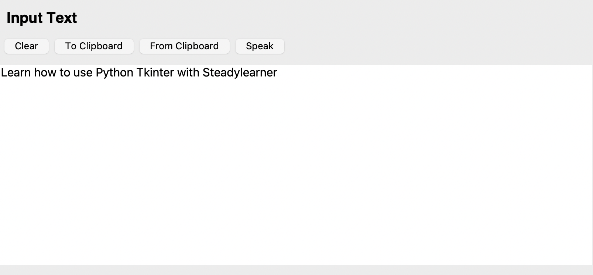

[You can follow me at GitHub.]: https://github.com/steadylearner

[You can contact or hire me at Telegram.]: https://t.me/steadylearner

[Python_Tkinter_Example]: https://github.com/steadylearner/Python_Tkinter_Example

[tinydb]: https://github.com/msiemens/tinydb



[You can follow me at GitHub.]: https://github.com/steadylearner

[You can contact or hire me at Telegram.]: https://t.me/steadylearner

[Python_Tkinter_Example]: https://github.com/steadylearner/Python_Tkinter_Example

[tinydb]: https://github.com/msiemens/tinydb

In this post, we will learn how to make a simple GUI CLI translator app with Python Tkinter similar to the cover of this blog post.

Before we start, please install Python and pip if you haven't yet. Then, read the docs for the packages we will use.

1. [How to install Python](https://realpython.com/installing-python/)

2. [How to install pip](https://linuxize.com/post/how-to-install-pip-on-ubuntu-18.04/)

The project is already complete at [Python_Tkinter_Example] repository. If you want to test it on your own first, please use these commands below.

```console
$git clone https://github.com/steadylearner/Python_Tkinter_Example.git
$cd Python_Tkinter_Example
$python3 -m venv app
$source app/bin/activate
$pip install -r requirements.txt
$python main.py
```

You will also need to have ffmpeg already installed at your machine. Otherwise, find commands like these to make it work at your machine. 

```console
$brew install ffmpeg --force
$brew link ffmpeg
```

Then, you can see if it installed with `$ffmpeg -h` command.


Testing those commands, you will see the Python GUI app. You can type what you want to translate at the Input Text form and it will show translated text at the Translated Text form below.

You can clear, paste a text from clipboard, copy the text to clipboard and make it speak repeatedly with the buttons. 

You can also use menu at the top to use your mic, text file or audio file as text input as well. If you want to, you can also save translated text or audio file.

You can also edit a form setting for how it should work for your preferred languages and voices similar to the image below.


You can find the default values for them at `settings.py` similar to this.

```py
TRANSLATED_TEXT_OPTIONS = [
    "en",
]

VOICE_LANGUAGE_OPTIONS = [
    "en_US",
]

VOICE_GENDER_OPTIONS = ["VoiceGenderMale", "VoiceGenderFemale", "None"]
```

You can update TRANSLATED_TEXT_OPTIONS, VOICE_LANGUAGE_OPTIONS and those values don't always work together well. Therefore, you will need to test yourself at your machine.

Those will be enough information to test the app. 

Before we start to see how the app work with details, please read these first.

* [building-a-text-editor-example-app](https://realpython.com/python-gui-tkinter/#building-a-text-editor-example-app)
* [tkinter-menu](https://www.pythontutorial.net/tkinter/tkinter-menu/)
* [tutorial-from-tkdocs](https://tkdocs.com/tutorial/index.html)

It will help you make your own component and menu after you read this post.

<!-- ## main.py -->

The entry point for this Tkinter app will be [main.py](https://github.com/steadylearner/Python_Tkinter_Example/blob/main/main.py) file. It will be the most important part for this ap.

To start with, you can see the code snippet at the end.

```py
if __name__ == "__main__":
    if len(read_settings("form")) == 0:
        upsert_settings(
            "form",
            {
                "input_text": "auto",
                "translated_text": "en",
                "voice_language": "en_US",
                "voice_gender": "VoiceGenderMale",
            },
        )

    window.mainloop()
```

Here, we save app settings with Python [tinydb] and you can also use another simple database options. It is included because Python is used here.

```py
 if len(read_settings("form")) == 0:
        upsert_settings(
            "form",
            {
                "input_text": "auto",
                "translated_text": "en",
                "voice_language": "en_US",
                "voice_gender": "VoiceGenderMale",
            },
        )
```

We save form settings to db.json unless it was already there with the settings. Then, we start the app with `window.mainloop()` part.

Tinydb relevant code snippets are saved at [database.py](https://github.com/steadylearner/Python_Tkinter_Example/blob/main/database.py)

```py
from tinydb import TinyDB, Query

db = TinyDB("db.json")
query = Query()
settings = db.table("settings")

def read_settings(name):
    return settings.search(query.name == name)


def upsert_settings(name, details):
    settings.upsert({"name": name, "details": details}, query.name == name)


def read_input_text_language():
    return read_settings("form")[0]["details"]["input_text"]


def read_translated_text_language():
    return read_settings("form")[0]["details"]["translated_text"]


def read_voice_language():
    return read_settings("form")[0]["details"]["voice_language"]


def read_voice_gender():
    return read_settings("form")[0]["details"]["voice_gender"]
```

Here, we save some read and upsert features for form settings to functions so we can easily reuse in other parts of the app.

We only need to save a single entry for form settings. You can include more settings to save here for your custom app later.

Then, there are `GoogleTranslator` and `recognizer` and `microphone`

They are used to recognize the text from audio files to use for the input form and use your microphone variable to use the microphone at your machine.

You can read the docs for them to see more details.

* [deep-translator](https://github.com/nidhaloff/deep-translator)
* [speech_recognition](https://github.com/Uberi/speech_recognition)

```py
import speech_recognition as sr
from deep_translator import GoogleTranslator

recognizer = sr.Recognizer()
microphone = sr.Microphone()
```

Those will be the main parts that make this app work at the behind. You can see its first usage at the debounced function below.

It translates the input text to what you set at settings whenever a user type something. It is debounced for a second because there are some rate limits from the google translator service we use for this app. 

This will prevent the request is sent to it whenever user type and stop the app to work.

```py
input_text_value = tk.StringVar()

@debounce(1)
def on_input_text_value_update(event):
    input_text_value.set(input_text.get("1.0", tk.END))

    translated = GoogleTranslator(
        source=read_input_text_language(), target=read_translated_text_language()
    ).translate(input_text_value.get())

    if read_voice_gender() != "None" and len(translated) != 0:
        q.put(translated)

    translated_text.config(state="normal")
    translated_text.replace("1.0", tk.END, translated)
    translated_text.config(state="disabled")

input_text.bind("<KeyRelease>", on_input_text_value_update)
```

Here, we save the input text form value to `input_text_value = tk.StringVar()` with `input_text_value.set(input_text.get("1.0", tk.END))` and read translated value of it.

The queue with a thread is used with `q.put(translated)` because the code to use speaker from `pyttx` doesn't work well without it.

```py
import pyttsx3
import threading
import queue

from tkinter import messagebox

from database import (
    read_voice_language,
    read_voice_gender,
)

class TTSThread(threading.Thread):
    def __init__(self, queue):
        threading.Thread.__init__(self)
        self.queue = queue
        self.daemon = True
        self.engine = pyttsx3.init()
        self.start()

    def run(self):
        self.engine.startLoop(False)
        t_running = True

        while t_running:
            if self.queue.empty():
                self.engine.iterate()
            else:
                data = self.queue.get()
                # print("data")
                # print(data)

                if data == "exit":
                    t_running = False
                else:
                    if self.change_voice(read_voice_language()) == True:
                        # self.engine.setProperty('rate', 10)
                        self.engine.say(data)

        self.engine.endLoop()

    def change_voice(self, language):
        gender = read_voice_gender()
        # print("gender")
        # print(gender)
        lang_correct = False
        gender_correct = False

        for voice in self.engine.getProperty("voices"):
            if language in voice.languages:
                lang_correct = True

                if gender == voice.gender:
                    gender_correct = True
                    self.engine.setProperty("voice", voice.id)
                    break
                else:
                    gender_correct = False
                    messagebox.showerror(
                        message="Gender '{}' not found for {}, update it at languages settings if you don't want to see this error".format(
                            gender, language
                        )
                    )
                    break
        # print("")
        if lang_correct == False and gender_correct == False:
            messagebox.showerror(
                message="Language '{}' not found, update Translated Voice if you don't want to see this error".format(
                    language, gender
                )
            )

        # Both should be True to speak
        return lang_correct and gender_correct


# create a queue to send commands from the main thread
q = queue.Queue()
tts_thread = TTSThread(q)  # note: thread is auto-starting
```

Here, we show a helpful error message to a user whenever any form settings option is unavailable in your machine using the messagebox from Tkinter. 

You can test it with other options at the form settings and you will see the error similar to this.


```py
messagebox.showerror(
                message="Language '{}' not found, update Translated Voice if you don't want to see this error".format(
                    language, gender
                )
            )
```

Then, if `read_voice_gender() != "None"` is True or if there was no text in the input text we don't send a queue to a speaker to speak the translated text. Otherwise, you will hear something from your machine. This is included because not always there is a voice ready for a language. If you don't want to see the warning you can set VOICE_GENDER_OPTIONS to None.

```py
translated_text.config(state="normal")
translated_text.replace("1.0", tk.END, translated)
translated_text.config(state="disabled")
```

To preserve translated text, the translated_text is uneditable by default but, here we save the translated text first and make it uneditable again with the code snippet above.

Until this, we learnt how to make your input text translated and hear it also. It is used for the GUI app but you will be able to use it in your web app or other projects also.

We still have some parts for layout.

```py
window = tk.Tk()
window.title(APP_TITLE)

window.rowconfigure(0, weight=1)
window.columnconfigure(1, weight=1)

menubar = Menu(window)
window.config(menu=menubar)

translation_form = tk.Frame(window)
translation_form.grid(row=0, column=1, sticky="nsew")

input_text_label = tk.Label(
    translation_form, text="Input Text", anchor="w", font=LABEL_FONT, padx=10, pady=10
)
input_text_label.grid(row=0, column=1, sticky="ew")

input_text = tk.Text(translation_form, font=TEXT_FONT, height=15)
input_text.grid(row=2, column=1, sticky="ew")

input_text_value = tk.StringVar()
```

First, we start the app with `window = tk.Tk()` and set title with `window.title(APP_TITLE)` you can edit app title at settings.py to use another title. window here is a top level component for your gui app. It is easily accessible with `winfo_toplevel()` we will see later. You don't need to pass it to the other components to use its other method by using that.

Then, we set menubar and assign to the window.

```py
menubar = Menu(window)
window.config(menu=menubar)
```

You can see you can include sub menubars here.

```py
menubar.add_cascade(
    label="File",
    menu=FileMenu(window, q, input_text, translated_text, recognizer, microphone),
    underline=0,
)

settings = Menu(menubar, tearoff=0)
settings.add_command(label="Form", command=lambda: show_form_settings_dialog(window))
```


`FileMenu` here is a component and you can see it uses `window, q, input_text, translated_text, recognizer, microphone` variables inside.

```py
class FileMenu(Menu):
    def __init__(self, master, q, input_text, translated_text, recognizer, microphone):
        super().__init__(master)

        self.q = q
        self.input_text = input_text
        self.translated_text = translated_text
        self.recognizer = recognizer
        self.microphone = microphone

        use_sub_menu = Menu(self, tearoff=0)
        use_sub_menu.add_command(
            label="Mic for Input Text", command=self.use_mic_for_input_text
        )
        use_sub_menu.add_command(
            label="Text File for Input Text", command=self.use_text_file_for_input_text
        )
        use_sub_menu.add_command(
            label="Audio File for Input Text",
            command=self.use_audio_file_for_input_text,
        )
        self.add_cascade(label="Use", menu=use_sub_menu)

        save_sub_menu = Menu(self, tearoff=0)
        save_sub_menu.add_command(
            label="Translated Text to a text file",
            command=self.save_translated_text_to_text_file,
        )
        save_sub_menu.add_command(
            label="Translated Text to an audio file",
            command=self.save_translated_text_to_audio_file,
        )
        self.add_cascade(label="Save", menu=save_sub_menu)

        self.add_separator()
        self.add_command(label="Close", command=self.master.destroy)

    def use_mic_for_input_text(self):
        """Use a mic for input text"""

        what_you_said = recognize_speech_from_mic(self.recognizer, self.microphone)

        if what_you_said["error"]:
            messagebox.showerror(title="Error", message=what_you_said["error"])
            return

        if not what_you_said["success"]:
            messagebox.showerror(
                title="Error", message="I couldn't read that. What did you say?"
            )
            return

        if what_you_said["transcription"] == None:
            messagebox.showerror(
                title="Error", message="Please, say something next time."
            )
        else:
            text = what_you_said["transcription"]

            translated = GoogleTranslator(
                source=read_input_text_language(),
                target=read_translated_text_language(),
            ).translate(text)

            self.q.put(translated)

            if len(self.input_text.get("1.0", END)) > 0:
                self.input_text.insert(END, f" {text}")
                self.translated_text.insert(END, f" {translated}")
            else:
                self.input_text.insert(END, f"{text}")
                self.translated_text.insert(END, f"{translated}")

    def use_text_file_for_input_text(self):
        """Use a text file for input text."""

        filepath = askopenfilename(
            filetypes=[("Text Files", "*.txt"), ("All Files", "*.*")]
        )
        if not filepath:
            # messagebox.showerror(title="Error", message="Use the correct filepath for the text file")
            return

        self.input_text.delete("1.0", END)
        self.translated_text.delete("1.0", END)
        with open(filepath, mode="r", encoding="utf-8") as input_file:
            text = input_file.read()
            self.input_text.insert(END, text)

            translated = GoogleTranslator(
                source=read_input_text_language(),
                target=read_translated_text_language(),
            ).translate(text)
            self.q.put(translated)

            self.translated_text.config(state="normal")
            self.translated_text.replace("1.0", END, translated)
            self.translated_text.config(state="disabled")

            self.master.title(f"{APP_TITLE} - {filepath}")

            # self.winfo_toplevel().title(f"{APP_TITLE} - {filepath}")

    def use_audio_file_for_input_text(self):
        """Use an audio file for input text."""

        filepath = askopenfilename(
            filetypes=[("Audio Files", "*.mp3"), ("Audio Files", "*.wav")],
        )
        if not filepath:
            # messagebox.showerror(
            #     title="Error", message="Use the correct filepath for the audio file")
            return

        # mp3
        # print("filepath")
        # print(filepath)
        # to wav file to use sr.AudioFile
        if filepath.endswith("mp3"):
            filepath_without_ext = filepath.split(".")[0]
            new_wav_filepath = f"{filepath_without_ext}.wav"

            subprocess.call(["ffmpeg", "-y", "-i", filepath, new_wav_filepath])

            audio = sr.AudioFile(new_wav_filepath)

            response = messagebox.askquestion(
                title=None,
                message="To use the mp3 file for the app, we had to make the file with .wav extension, do you want to remove the original mp3 file?",
            )
            if response == "yes":
                os.remove(filepath)
                messagebox.showinfo(message=f"The mp3 file at {filepath} was removed")

        else:
            audio = sr.AudioFile(filepath)

        with audio as source:
            # This doesn't work here.
            # recognizer.adjust_for_ambient_noise(source)

            audio = self.recognizer.record(source)

            try:
                transcription = str(
                    self.recognizer.recognize_google(audio, show_all=False)
                )

                self.input_text.delete("1.0", END)
                self.translated_text.delete("1.0", END)

                self.input_text.insert(END, transcription)

                translated = GoogleTranslator(
                    source=read_input_text_language(),
                    target=read_translated_text_language(),
                ).translate(transcription)
                self.q.put(translated)

                self.translated_text.config(state="normal")
                self.translated_text.replace("1.0", END, translated)
                self.translated_text.config(state="disabled")

                self.master.title(f"{APP_TITLE} - {filepath}")
                # self.winfo_toplevel().title(f"{APP_TITLE} - {filepath}")
            except:
                messagebox.showinfo("Something went wrong while reading the audio file")

    def save_translated_text_to_text_file(self):
        """Save the translated_text as a new file."""

        filepath = asksaveasfilename(
            defaultextension=".txt",
            filetypes=[("Text Files", "*.txt"), ("All Files", "*.*")],
        )
        if not filepath:
            return

        with open(filepath, mode="w", encoding="utf-8") as output_file:
            translated = self.translated_text.get("1.0", END)
            output_file.write(translated)
            messagebox.showinfo(message=f"The file was saved")

            self.master.title(f"{APP_TITLE} - {filepath}")
            # self.winfo_toplevel().title(f"{APP_TITLE} - {filepath}")

    def save_translated_text_to_audio_file(self):
        """Save the translated_text as a new file."""

        # Should be wav instead of mp3
        filepath = asksaveasfilename(
            defaultextension=".mp3",
            filetypes=[("Audio Files", "*.mp3"), ("All Files", "*.*")],
        )
        if not filepath:
            return

        with open(filepath, mode="w", encoding="utf-8") as output_file:
            translated = self.translated_text.get("1.0", END)

            tts = gtts.gTTS(
                text=translated, lang=read_translated_text_language()
            )  # Include it for settings or input bar for text input or dropdown
            tts.save(filepath)  # mp3
            messagebox.showinfo(message=f"The file was saved")

            self.master.title(f"{APP_TITLE} - {filepath}")
            # self.winfo_toplevel().title(f"{APP_TITLE} - {filepath}")
```

It has various methods you can use to use text or audio file as a text input source or save translated text to text or audio and reuse later.

The ffmpeg is used with `subprocess` to turn mp3 file to wav extension because some packages used here allows different file formats.

```py
subprocess.call(["ffmpeg", "-y", "-i", filepath, new_wav_filepath])
```

Please, use each option while you testing the app with `$python main.py` especially for "Mic for Input Text" option.

There are other files in components folder but they do all similar things so please read and test the app yourself.

If you want to, you can make a binary executable file with `$python cli.py build app` command.

It uses the [pyinstaller](https://github.com/pyinstaller/pyinstaller) command behind and please read their docs if you want to know more details.

When you test the app locally, it might use a lot of resources of your machine. But, it will not have that issue when you test with the binary app built from the command.

You can test it with ./app at dist folder and you will be able to use it without making it work locally with your console.

[You can follow me at GitHub.]

[You can contact or hire me at Telegram.]

**Thanks and please share this post with others.**
